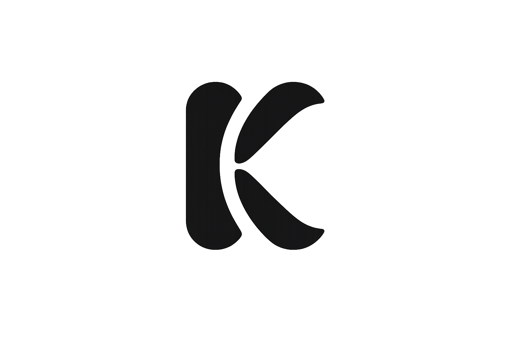

# Kapsule — Everything important. One place.



> **Kapsule**, önemli her şeyi tek bir kasa altında toplayan kişisel dijital kasa uygulamasıdır. Belgeler, fişler, abonelikler, garantiler, notlar ve yer imleri — hepsi tek bir yerden, ultra güvenli, çevrimdışı ve sessiz lüks (Quiet Luxury) arayüzle yönetilir.  
> **Apple App Store** ve **Google Play Store** mağaza standartlarına uygun olarak React 18, TypeScript ve Capacitor ile paketlenmiştir.

---

## Öne Çıkan Özellikler

### Kasa ve Donanım Güvenliği
- **Kişisel Kasa PIN Kilidi ve Kaba Kuvvet Koruması:** 4 haneli PIN şifreleme ve 5 hatalı deneme sonrası 30 saniyelik otomatik donanım kilidi.
- **Biyometrik Giriş (Face ID / Touch ID / Parmak İzi):** Cihaz donanımıyla tek dokunuşla kilit açma (`NativeBiometricsService`).
- **Sıfır Sunucu ve %100 Çevrimdışı Gizlilik:** Hiçbir veri üçüncü taraf sunuculara veya izleyicilere aktarılmaz; veriler sadece cihazın korumalı sandbox alanında saklanır.
- **Android `allowBackup="false"` Koruması:** USB ve adb üzerinden şifresiz veri sızıntılarına karşı tam koruma (OWASP MASVS standartları).

### Kamera, Görseller ve Fotoğraf Kırpma
- **Doğrudan Fiş ve Belge Tarama:** `@capacitor/camera` entegrasyonu ile kamera veya galeriden belge tarayıp kasaya ekleme.
- **İnteraktif Profil Kırpma ve Hizalama (Avatar Cropper):** 
  - Dokunmatik ve fare ile vizör içinde kaydırma (pan drag)
  - 1x - 3x kesintisiz yakınlaştırma kaydırıcısı (zoom slider)
  - 90 derece yön çevirme ve sıfırlama
  - 3te 1 kuralı kılavuz ızgarası (rule-of-thirds grid)
  - 400x400 px yüksek kaliteli JPEG kayıpsız çıktı

### Quiet Luxury Tasarım ve Akıcılık
- **Ultra Akıcı Sayfa Geçişleri (Zero-Jank):** 0ms tepki süresi, GPU hızlandırmalı 180ms mikro geçişler; 60/120 FPS akıcı kart fiziği.
- **Çift Katmanlı Çekmeceler (Slide-Out Drawers):** Profil kartı ve abonelik kartlarında tek tıkla açılıp kapanan, simetrik ve dengeli arayüz mimarisi.
- **İnteraktif Cüzdan (WalletCard):** Fiziksel kart cebi hissi, kartlar arası akıcı geçiş animasyonu.
- **Safe Area ve Donanım Geometrisi:** Dynamic Island, çentik (`safe-area-inset-top`) ve alt Home Indicator (`safe-area-inset-bottom`) ile tam uyumlu.
- **Koyu / Açık Mod ve StatusBar Senkronizasyonu:** `NativeStatusBarService` ile sistem temasına göre otomatik güncellenen durum çubuğu stili.

### Mağaza ve Yasal Uyumluluk (Store Compliance)
- **Apple App Store Review 5.1.1 Uyumlu:** Uygulama içi Gizlilik Politikası, Kullanım Koşulları ve İletişim modalları.
- **Veri Sıfırlama (Data Deletion):** Apple Store zorunlu kuralı uyarınca çift onaylı tüm kasayı sıfırlama mekanizması.
- **Google Play Target SDK 36:** Android 14+ gereksinimlerini karşılayan güncel API seviyesi.
- **Native Paylaşım (Share Sheet):** AirDrop, WhatsApp, Google Drive ve Dosyalar üzerinden şifreli JSON kasa yedeği dışa aktarma (`@capacitor/share`).

---

## Teknolojiler

| Teknoloji | Amaç |
|---|---|
| [React 18](https://react.dev/) | Reaktif bileşen mimarisi ve UI katmanı |
| [TypeScript](https://www.typescriptlang.org/) | Sıkı tip denetimi ve mimari güvenilirlik (0 Any, 0 Hata) |
| [Vite](https://vite.dev/) | Hızlı derleme ve optimize üretim paketi |
| [Tailwind CSS](https://tailwindcss.com/) | Quiet Luxury tasarım sistemi ve HSL tokenları |
| [Framer Motion](https://www.framer.com/motion/) | GPU hızlandırmalı animasyonlar ve yay dinamikleri |
| [Lucide React](https://lucide.dev/) | Vektörel ikon kütüphanesi |
| [Capacitor](https://capacitorjs.com/) | Android ve iOS native mobil kabuk |
| [Capacitor Camera](https://capacitorjs.com/docs/apis/camera) | Kamera ve galeri erişimi |
| [Capacitor Preferences](https://capacitorjs.com/docs/apis/preferences) | Kalıcı native cihaz depolaması |
| [Capacitor Share](https://capacitorjs.com/docs/apis/share) | Native paylaşım menüsü (Share Sheet) |
| [Capacitor Haptics](https://capacitorjs.com/docs/apis/haptics) | Dokunsal geri bildirim motoru |
| [Capacitor Status Bar](https://capacitorjs.com/docs/apis/status-bar) | Sistem çubuğu renk ve stil senkronizasyonu |
| [Capacitor Splash Screen](https://capacitorjs.com/docs/apis/splash-screen) | Lüks açılış ekranı ve pürüzsüz hidrasyon |

---

## Proje Mimarisi

```text
kapsule/
├── android/                 # Capacitor Android native projesi (Gradle, Manifest, Mipmap ikonları)
├── ios/                     # Capacitor iOS native projesi (Xcode Workspace, Info.plist, AppIcon)
├── public/                  # Statik varlıklar (logo.png, favicon.svg)
├── scripts/                 # Varlık üretim otomasyonu (generate-icons.js)
├── src/
│   ├── assets/              # Marka varlıkları ve 3D çizimler
│   ├── components/          # Ortak UI bileşenleri (Button, Badge, Card, Toast, PasscodeLock ...)
│   ├── features/            # Ekranlar
│   │   ├── home/            # Kasa özeti, son işlemler, hızlı aksiyonlar
│   │   ├── documents/       # Belge arşivleme ve kategorizasyon
│   │   ├── receipts/        # Fiş tarama, kamera ve iade takvimi
│   │   ├── subscriptions/   # Çekmeceli abonelik kartları ve maliyet projeksiyonu
│   │   ├── warranties/      # Garanti takibi ve bitiş alarmları
│   │   ├── notes/           # Güvenli kişisel notlar
│   │   ├── bookmarks/       # Bağlantı ve yer imleri
│   │   ├── timeline/        # Zaman akışı ve harcama grafikleri
│   │   └── settings/        # Profil, AvatarCropModal, LegalModals, PIN ve tema
│   ├── layouts/             # MainLayout, MobileNav, Sidebar (Safe area uyumlu)
│   ├── services/            # vaultStorage, storageAdapter, nativeBiometrics, nativeShare, nativeCamera
│   ├── styles/              # globals.css (Quiet luxury CSS tokenları)
│   └── types/               # TypeScript tip ve arayüz tanımları
├── capacitor.config.ts      # Capacitor köprü yapılandırması
├── STORE-YAYINLAMA-YOL-HARITASI.md  # Mağaza yayınlama yol haritası ve kontrol listesi
└── MAGAZA-YAYINLAMA-REHBERI.md      # ASO metinleri, ekran görüntüsü ebatları ve yayın rehberi
```

---

## Kurulum ve Çalıştırma

Gereksinimler: **Node.js 18+**

```bash
# Bağımlılıkları yükle
npm install

# Geliştirme sunucusunu başlat (localhost:3000 / 3001)
npm run dev

# Tip kontrolü ve üretim derlemesi
npm run build
```

### Mobil Uygulama Derleme (Capacitor)

```bash
# Web paketini derle ve native platformlara senkronize et
npm run build
npx cap sync

# Android Studio ile aç ve derle
npx cap open android

# Xcode ile aç ve derle (macOS gereklidir)
npx cap open ios
```

---

## Mağaza Yayınlama Rehberleri

- [STORE-YAYINLAMA-YOL-HARITASI.md](STORE-YAYINLAMA-YOL-HARITASI.md) — 5 aşamalı mağaza yayınlama eylem planı.
- [MAGAZA-YAYINLAMA-REHBERI.md](MAGAZA-YAYINLAMA-REHBERI.md) — App Store ve Google Play başlık, açıklama, anahtar kelime ve ekran görüntüsü rehberi.

---

## Lisans ve Gizlilik

Kapsule, kullanıcı gizliliğini en üst düzeyde tutacak şekilde tasarlanmıştır. Tüm veriler yalnızca kullanıcı cihazında depolanır.