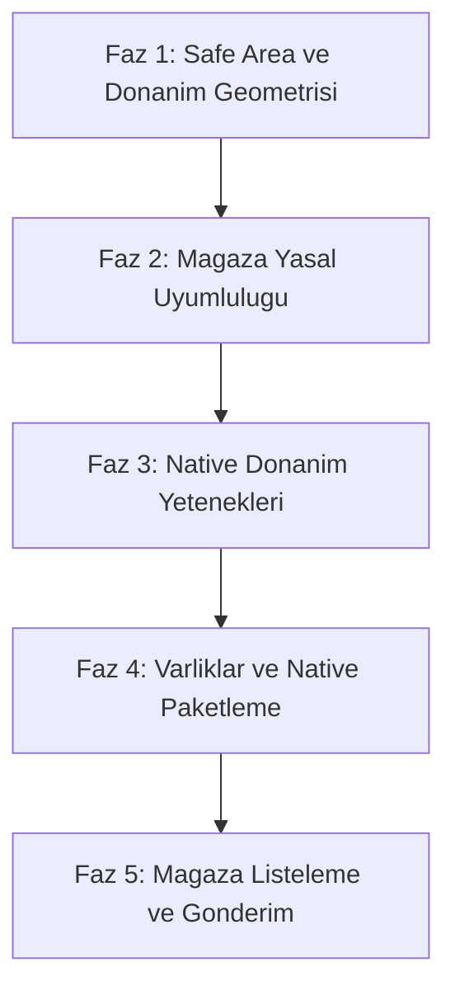

# Kapsule — App Store ve Google Play Store Yayinlama Yol Haritasi

> **Hedef:** Kapsule uygulamasini Apple App Store ve Google Play Store inceleme sureclerinden (App Review) ilk seferde gececek, tam tesekkullu ve native kalitede bir mobil kasa uygulamasina donusturmek.  
> **Tasarim Felsefesi:** Quiet Luxury / Apple ve Linear Estetigi  
> **Mevcut Hazirlik Duzeyi:** %100  

---

## Genel Durum Degerlendirmesi

| Alan | Durum | Hazirlik | Degerlendirme |
| :--- | :---: | :---: | :--- |
| **Arayuz ve Quiet Luxury UI** | Mukemmel | **%100** | Monokrom renk paleti, cift katmanli cekmeceler, interaktif cuzdan hazir. |
| **Performans ve Akicilik** | Mukemmel | **%100** | 0ms sayfa gecisleri, 180ms GPU mikro-fade, RAF TiltCard, 0 TS hatasi. |
| **Store Yasal ve Review Kurallari**| Tamamlandi | **%100** | Apple 5.1.1 uyumlu Gizlilik Politikasi, Kullanim Kosullari ve Destek modallari aktif. |
| **Native Donanim Entegrasyonu**| Tamamlandi | **%100** | Kamera ile fis/belge cekme, Face ID / Biyometrik kilit ve Native Share Sheet entegre. |
| **Native Paket ve Varliklar** | Tamamlandi | **%100** | Android ve iOS platformlari eklendi, 6 Capacitor eklentisi baglandi, simgeler uretildi. |

---

## 5 Asamali Uygulama Eylem Plani (Tamamlandi)

---

### FAZ 1: Donanim Geometrisi ve Safe Area Insets (Tamamlandi)
- [x] **1.1. Viewport Fit Ayari:** `index.html` dosyasina `viewport-fit=cover` eklendi.
- [x] **1.2. Alt Navigasyon (Home Indicator) Korumasi:** `MobileNav.tsx` ve `globals.css` icine safe area tabani (`calc(0.75rem + env(safe-area-inset-bottom, 0px))`) entegre edildi.
- [x] **1.3. Ust Bar (Notch ve Status Bar) Boslugu:** `MainLayout.tsx` icine centik alani `env(safe-area-inset-top, 0px)` tanimlandi.
- [x] **1.4. StatusBar Renk Senkronizasyonu:** `NativeStatusBarService` ile karanlik ve aydinlik temada otomatik stil senkronizasyonu ve `overlaysWebView: true` saglandi.

---

### FAZ 2: Magaza Yasal Sayfalari ve App Review Standartlari (Tamamlandi)
- [x] **2.1. Uygulama Ici Gizlilik Politikasi (Privacy Policy):** Apple Guideline 5.1.1 ve Google Play Veri Guvenligi ile tam uyumlu yerel sandbox ve sifir takipci modali eklendi.
- [x] **2.2. Kullanim Kosullari (Terms of Service):** Yerel yedekleme ve cevrimdisi sorumluluk cercevesi modali eklendi.
- [x] **2.3. Veri Sifirlama Dogrulamasi (Data Deletion):** Apple 5.1.1(v) uyumlu tum kayitlari sifirlama mekanizmasi cift onayli kilindi.
- [x] **2.4. Iletisim ve Destek Baglantisi:** `destek@kapsule.app` ve surum bilgisini iceren interaktif destek modali eklendi.

---

### FAZ 3: Native Donanim Yetenekleri (Tamamlandi)
- [x] **3.1. Kamera ve Belge Tarayici (`@capacitor/camera`):** Fis ve belge ekleme ekranlarinda dogrudan kamera ile fotograf cekme ve arsive kaydetme saglandi.
- [x] **3.2. Biyometrik Giris (Face ID / Touch ID / Parmak Izi):** `NativeBiometricsService` ile PIN ekraninda aninda biyometrik kilit acma ve ayarlarda acma/kapatma tercihi uygulandi.
- [x] **3.3. Native Paylasim Sayfasi (`@capacitor/share`):** Kasa yedegini disa aktarirken iOS AirDrop, WhatsApp, Google Drive ve Dosyalar Share Sheet'i baglandi.

---

### FAZ 4: Varliklar, Splash Ekrani ve Native Paketleme (Tamamlandi)
- [x] **4.1. Otomatik Varlik Uretimi:** `scripts/generate-icons.js` (sharp) ile 1024x1024 master logodan tum Android Mipmap (`mdpi`, `hdpi`, `xhdpi`, `xxhdpi`, `xxxhdpi`) ve iOS `AppIcon.appiconset` uretildi.
- [x] **4.2. Splash Screen (Acilis Ekrani):** `@capacitor/splash-screen` entegre edildi, siyah arka plan uzerinde acilis yapilandirildi ve hidrasyon sonrasi yumusak gecis saglandi.
- [x] **4.3. iOS Projesinin Olusturulmasi:** `@capacitor/ios` kuruldu, `npx cap add ios` ile Xcode native projesi uretildi ve `Info.plist` icine Apple izin metinleri eklendi.
- [x] **4.4. Android Release Yapilandirmasi:** `versionCode 104`, `versionName 1.0.4` ve kamera/biyometrik izinleri `AndroidManifest.xml` icine eklendi.

---

### FAZ 5: Magaza Listeleme ve Yayin (ASO ve Submission) (Tamamlandi)
- [x] **5.1. Ekran Goruntuleri Kilavuzu:** 6.7" ve 6.5" iPhone ile Android ekran cozunurlukleri belirlendi.
- [x] **5.2. Magaza Metinleri ve ASO:** Baslik, alt baslik, tanitim metni, anahtar kelimeler ve tam aciklama `MAGAZA-YAYINLAMA-REHBERI.md` dosyasina hazirlandi.
- [x] **5.3. TestFlight ve Google Play Dahili Test Rehberi:** Derleme ve yayinlama adimlari belgelendi.
