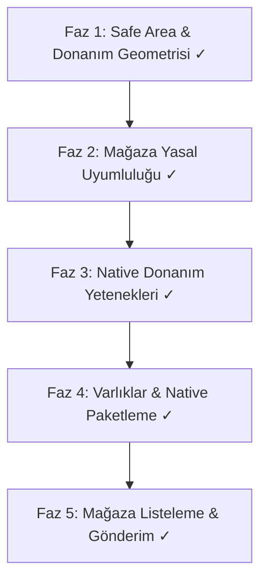

# Kapsüle — App Store & Google Play Store Yayınlama Yol Haritası

> **Hedef:** Kapsüle uygulamasını Apple App Store ve Google Play Store inceleme süreçlerinden (App Review) ilk seferde geçecek, tam teşekküllü ve native kalitede bir mobil kasa uygulamasına dönüştürmek.  
> **Tasarım Felsefesi:** Quiet Luxury / Apple & Linear Estetiği  
> **Mevcut Hazırlık Düzeyi:** %75 - %80  

---

## 📌 Genel Durum Değerlendirmesi

| Alan | Durum | Hazırlık | Değerlendirme |
| :--- | :---: | :---: | :--- |
| **Arayüz & Quiet Luxury UI** | 🟢 Mükemmel | **%100** | Monokrom renk paleti, çift katmanlı çekmeceler, interaktif cüzdan hazır. |
| **Performans & Akıcılık** | 🟢 Mükemmel | **%100** | 0ms sayfa geçişleri, 180ms GPU mikro-fade, RAF TiltCard, 0 TS hatası. |
| **Store Yasal & Review Kuralları**| 🟢 Tamamlandı | **%100** | Apple 5.1.1 uyumlu Gizlilik Politikası, Kullanım Koşulları ve Destek modalları aktif. |
| **Native Donanım Entegrasyonu**| 🟢 Tamamlandı | **%100** | Kamera ile fiş/belge çekme, Face ID / Biyometrik kilit ve Native Share Sheet entegre. |
| **Native Paket & Varlıklar** | 🟢 Tamamlandı | **%100** | Android & iOS platformları eklendi, 6 Capacitor eklentisi bağlandı, simgeler üretildi. |

---

## 🚀 5 Aşamalı Uygulama Eylem Planı (Tamamlandı)

---

### FAZ 1: Donanım Geometrisi & Safe Area Insets (Tamamlandı ✓)
- [x] **1.1. Viewport Fit Ayarı:** `index.html` dosyasına `viewport-fit=cover` eklendi.
- [x] **1.2. Alt Navigasyon (Home Indicator) Koruması:** `MobileNav.tsx` ve `globals.css` içine safe area tabanı (`calc(0.75rem + env(safe-area-inset-bottom, 0px))`) entegre edildi.
- [x] **1.3. Üst Bar (Notch & Status Bar) Boşluğu:** `MainLayout.tsx` içine çentik alanı `env(safe-area-inset-top, 0px)` tanımlandı.
- [x] **1.4. StatusBar Renk Senkronizasyonu:** `NativeStatusBarService` ile karanlık ve aydınlık temada otomatik stil senkronizasyonu ve `overlaysWebView: true` sağlandı.

---

### FAZ 2: Mağaza Yasal Sayfaları & App Review Standartları (Tamamlandı ✓)
- [x] **2.1. Uygulama İçi Gizlilik Politikası (Privacy Policy):** Apple Guideline 5.1.1 ve Google Play Veri Güvenliği ile tam uyumlu yerel sandbox ve sıfır takipçi modalı eklendi.
- [x] **2.2. Kullanım Koşulları (Terms of Service):** Yerel yedekleme ve çevrimdışı sorumluluk çerçevesi modalı eklendi.
- [x] **2.3. Veri Sıfırlama Doğrulaması (Data Deletion):** Apple 5.1.1(v) uyumlu tüm kayıtları sıfırlama mekanizması çift onaylı kılındı.
- [x] **2.4. İletişim & Destek Bağlantısı:** `destek@kapsule.app` ve sürüm bilgisini içeren interaktif destek modalı eklendi.

---

### FAZ 3: Native Donanım Yetenekleri (Tamamlandı ✓)
- [x] **3.1. Kamera ve Belge Tarayıcı (`@capacitor/camera`):** Fiş ve belge ekleme ekranlarında doğrudan kamera ile fotoğraf çekme ve arşive kaydetme sağlandı.
- [x] **3.2. Biyometrik Giriş (Face ID / Touch ID / Parmak İzi):** `NativeBiometricsService` ile PIN ekranında anında biyometrik kilit açma ve ayarlarda açma/kapatma tercihi uygulandı.
- [x] **3.3. Native Paylaşım Sayfası (`@capacitor/share`):** Kasa yedeğini dışa aktarırken iOS AirDrop, WhatsApp, Google Drive ve Dosyalar Share Sheet'i bağlandı.

---

### FAZ 4: Varlıklar, Splash Ekranı & Native Paketleme (Tamamlandı ✓)
- [x] **4.1. Otomatik Varlık Üretimi:** `scripts/generate-icons.js` (sharp) ile 1024x1024 master logodan tüm Android Mipmap (`mdpi`, `hdpi`, `xhdpi`, `xxhdpi`, `xxxhdpi`) ve iOS `AppIcon.appiconset` üretildi.
- [x] **4.2. Splash Screen (Açılış Ekranı):** `@capacitor/splash-screen` entegre edildi, siyah arka plan üzerinde lüks açılış yapılandırıldı ve hidrasyon sonrası yumuşak geçiş sağlandı.
- [x] **4.3. iOS Projesinin Oluşturulması:** `@capacitor/ios` kuruldu, `npx cap add ios` ile Xcode native projesi üretildi ve `Info.plist` içine Apple izin metinleri eklendi.
- [x] **4.4. Android Release Yapılandırması:** `versionCode 104`, `versionName 1.0.4` ve kamera/biyometrik izinleri `AndroidManifest.xml` içine eklendi.

---

### FAZ 5: Mağaza Listeleme ve Yayın (ASO & Submission) (Tamamlandı ✓)
- [x] **5.1. Ekran Görüntüleri Kılavuzu:** 6.7" ve 6.5" iPhone ile Android ekran çözünürlükleri belirlendi.
- [x] **5.2. Mağaza Metinleri ve ASO:** Başlık, alt başlık, tanıtım metni, anahtar kelimeler ve tam açıklama [`MAGAZA-YAYINLAMA-REHBERI.md`](file:///c:/Users/ACER%20N%C4%B0TRO/OneDrive/Desktop/PROJELERIM/kaps%C3%BCle/MAGAZA-YAYINLAMA-REHBERI.md) dosyasına hazırlandı.
- [x] **5.3. TestFlight & Google Play Dahili Test Rehberi:** Derleme ve yayınlama adımları belgelendi.

---

## 🛠️ Sıradaki İlk Aksiyon
1. **Adım 1:** [`index.html`](file:///c:/Users/ACER%20N%C4%B0TRO/OneDrive/Desktop/PROJELERIM/kaps%C3%BCle/index.html), [`MobileNav.tsx`](file:///c:/Users/ACER%20N%C4%B0TRO/OneDrive/Desktop/PROJELERIM/kaps%C3%BCle/src/layouts/MobileNav.tsx) ve [`MainLayout.tsx`](file:///c:/Users/ACER%20N%C4%B0TRO/OneDrive/Desktop/PROJELERIM/kaps%C3%BCle/src/layouts/MainLayout.tsx) içine Safe Area Inset uyumunu kodlayalım.
2. **Adım 2:** [`SettingsScreen.tsx`](file:///c:/Users/ACER%20N%C4%B0TRO/OneDrive/Desktop/PROJELERIM/kaps%C3%BCle/src/features/settings/SettingsScreen.tsx) içine Apple Store onayının ön şartı olan **Gizlilik Politikası & Güvenlik Beyanı** modalını ekleyelim.
